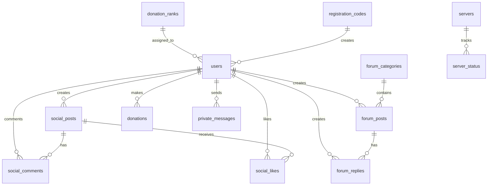

# Database Schema Documentation

## Overview

Vonix Network uses Turso (edge SQLite) as its primary database. The schema is designed to support a comprehensive Minecraft community platform with user management, forums, social features, and server integration.

## Database Technology

- **Database**: Turso (Edge SQLite)
- **ORM**: Drizzle ORM
- **Migrations**: Drizzle Kit
- **Connection**: LibSQL client

## Schema Overview



## Core Tables

### Users Table

```sql
CREATE TABLE users (
  id INTEGER PRIMARY KEY AUTOINCREMENT,
  username TEXT NOT NULL UNIQUE,
  email TEXT UNIQUE,
  password TEXT,
  role TEXT NOT NULL DEFAULT 'user' CHECK (role IN ('user', 'moderator', 'admin')),
  minecraft_username TEXT,
  minecraft_uuid TEXT UNIQUE,
  avatar TEXT,
  bio TEXT,
  donation_rank_id TEXT,
  rank_expires_at INTEGER,
  total_donated REAL DEFAULT 0,
  created_at INTEGER NOT NULL DEFAULT (unixepoch()),
  updated_at INTEGER NOT NULL DEFAULT (unixepoch())
);
```

**Purpose**: Stores user accounts and profiles
**Key Features**:
- Minecraft integration with UUID linking
- Role-based access control
- Donation tracking
- Avatar and bio support

**Indexes**:
- `username` (unique)
- `email` (unique)
- `minecraft_uuid` (unique)
- `donation_rank_id`

### Servers Table

```sql
CREATE TABLE servers (
  id INTEGER PRIMARY KEY AUTOINCREMENT,
  name TEXT NOT NULL,
  description TEXT,
  ip_address TEXT NOT NULL,
  port INTEGER DEFAULT 25565,
  version TEXT,
  modpack_name TEXT,
  bluemap_url TEXT,
  curseforge_url TEXT,
  status TEXT DEFAULT 'offline' CHECK (status IN ('online', 'offline', 'maintenance')),
  players_online INTEGER DEFAULT 0,
  players_max INTEGER DEFAULT 0,
  order_index INTEGER DEFAULT 0,
  created_at INTEGER NOT NULL DEFAULT (unixepoch()),
  updated_at INTEGER NOT NULL DEFAULT (unixepoch())
);
```

**Purpose**: Manages Minecraft server information
**Key Features**:
- Live status tracking
- Player count monitoring
- Modpack integration
- Custom ordering

**Indexes**:
- `ip_address`
- `order_index`
- `status`

### Forum Categories Table

```sql
CREATE TABLE forum_categories (
  id INTEGER PRIMARY KEY AUTOINCREMENT,
  name TEXT NOT NULL,
  description TEXT,
  slug TEXT NOT NULL UNIQUE,
  icon TEXT,
  order_index INTEGER DEFAULT 0,
  created_at INTEGER NOT NULL DEFAULT (unixepoch()),
  updated_at INTEGER NOT NULL DEFAULT (unixepoch())
);
```

**Purpose**: Organizes forum topics into categories
**Key Features**:
- SEO-friendly slugs
- Custom icons
- Ordering system

**Indexes**:
- `slug` (unique)
- `order_index`

### Forum Posts Table

```sql
CREATE TABLE forum_posts (
  id INTEGER PRIMARY KEY AUTOINCREMENT,
  title TEXT NOT NULL,
  content TEXT NOT NULL,
  category_id INTEGER NOT NULL,
  author_id INTEGER NOT NULL,
  pinned BOOLEAN DEFAULT FALSE,
  locked BOOLEAN DEFAULT FALSE,
  views INTEGER DEFAULT 0,
  created_at INTEGER NOT NULL DEFAULT (unixepoch()),
  updated_at INTEGER NOT NULL DEFAULT (unixepoch()),
  FOREIGN KEY (category_id) REFERENCES forum_categories(id) ON DELETE CASCADE,
  FOREIGN KEY (author_id) REFERENCES users(id) ON DELETE CASCADE
);
```

**Purpose**: Stores forum topics and posts
**Key Features**:
- Rich content support
- Pinning and locking
- View tracking
- Author attribution

**Indexes**:
- `category_id`
- `author_id`
- `created_at`
- `pinned`

### Forum Replies Table

```sql
CREATE TABLE forum_replies (
  id INTEGER PRIMARY KEY AUTOINCREMENT,
  content TEXT NOT NULL,
  post_id INTEGER NOT NULL,
  author_id INTEGER NOT NULL,
  created_at INTEGER NOT NULL DEFAULT (unixepoch()),
  updated_at INTEGER NOT NULL DEFAULT (unixepoch()),
  FOREIGN KEY (post_id) REFERENCES forum_posts(id) ON DELETE CASCADE,
  FOREIGN KEY (author_id) REFERENCES users(id) ON DELETE CASCADE
);
```

**Purpose**: Stores replies to forum posts
**Key Features**:
- Threaded discussions
- Author tracking
- Cascade deletion

**Indexes**:
- `post_id`
- `author_id`
- `created_at`

### Social Posts Table

```sql
CREATE TABLE social_posts (
  id INTEGER PRIMARY KEY AUTOINCREMENT,
  content TEXT NOT NULL,
  image_url TEXT,
  user_id INTEGER NOT NULL,
  created_at INTEGER NOT NULL DEFAULT (unixepoch()),
  updated_at INTEGER NOT NULL DEFAULT (unixepoch()),
  FOREIGN KEY (user_id) REFERENCES users(id) ON DELETE CASCADE
);
```

**Purpose**: Stores social media-style posts
**Key Features**:
- Image support
- User attribution
- Timestamp tracking

**Indexes**:
- `user_id`
- `created_at`

### Social Comments Table

```sql
CREATE TABLE social_comments (
  id INTEGER PRIMARY KEY AUTOINCREMENT,
  content TEXT NOT NULL,
  post_id INTEGER NOT NULL,
  user_id INTEGER NOT NULL,
  parent_comment_id INTEGER,
  created_at INTEGER NOT NULL DEFAULT (unixepoch()),
  updated_at INTEGER NOT NULL DEFAULT (unixepoch()),
  FOREIGN KEY (post_id) REFERENCES social_posts(id) ON DELETE CASCADE,
  FOREIGN KEY (user_id) REFERENCES users(id) ON DELETE CASCADE,
  FOREIGN KEY (parent_comment_id) REFERENCES social_comments(id) ON DELETE CASCADE
);
```

**Purpose**: Stores comments on social posts
**Key Features**:
- Nested replies
- Post association
- User tracking

**Indexes**:
- `post_id`
- `user_id`
- `parent_comment_id`
- `created_at`

### Social Likes Table

```sql
CREATE TABLE social_likes (
  id INTEGER PRIMARY KEY AUTOINCREMENT,
  post_id INTEGER NOT NULL,
  user_id INTEGER NOT NULL,
  created_at INTEGER NOT NULL DEFAULT (unixepoch()),
  FOREIGN KEY (post_id) REFERENCES social_posts(id) ON DELETE CASCADE,
  FOREIGN KEY (user_id) REFERENCES users(id) ON DELETE CASCADE,
  UNIQUE(post_id, user_id)
);
```

**Purpose**: Tracks likes on social posts
**Key Features**:
- Unique constraint prevents duplicate likes
- Cascade deletion

**Indexes**:
- `post_id`
- `user_id`
- `(post_id, user_id)` (unique)

### Donation Ranks Table

```sql
CREATE TABLE donation_ranks (
  id TEXT PRIMARY KEY,
  name TEXT NOT NULL,
  min_amount REAL NOT NULL,
  color TEXT NOT NULL,
  text_color TEXT NOT NULL,
  icon TEXT,
  badge TEXT,
  glow BOOLEAN DEFAULT FALSE,
  duration INTEGER DEFAULT 30,
  subtitle TEXT,
  created_at INTEGER NOT NULL DEFAULT (unixepoch()),
  updated_at INTEGER NOT NULL DEFAULT (unixepoch())
);
```

**Purpose**: Defines donation tiers and benefits
**Key Features**:
- Customizable appearance
- Duration-based benefits
- Badge system

**Indexes**:
- `min_amount`

### Donations Table

```sql
CREATE TABLE donations (
  id INTEGER PRIMARY KEY AUTOINCREMENT,
  user_id INTEGER,
  username TEXT,
  minecraft_username TEXT,
  amount REAL NOT NULL,
  currency TEXT NOT NULL DEFAULT 'USD',
  method TEXT,
  message TEXT,
  displayed BOOLEAN DEFAULT TRUE,
  created_at INTEGER NOT NULL DEFAULT (unixepoch()),
  updated_at INTEGER NOT NULL DEFAULT (unixepoch()),
  FOREIGN KEY (user_id) REFERENCES users(id) ON DELETE SET NULL
);
```

**Purpose**: Tracks donation records
**Key Features**:
- Multiple payment methods
- Display control
- User association

**Indexes**:
- `user_id`
- `created_at`
- `displayed`

### Registration Codes Table

```sql
CREATE TABLE registration_codes (
  id INTEGER PRIMARY KEY AUTOINCREMENT,
  code TEXT NOT NULL UNIQUE,
  minecraft_username TEXT NOT NULL,
  minecraft_uuid TEXT NOT NULL,
  used BOOLEAN DEFAULT FALSE,
  user_id INTEGER,
  expires_at INTEGER NOT NULL,
  created_at INTEGER NOT NULL DEFAULT (unixepoch()),
  used_at INTEGER,
  FOREIGN KEY (user_id) REFERENCES users(id) ON DELETE SET NULL
);
```

**Purpose**: Manages registration codes for Minecraft players
**Key Features**:
- Expiration system
- Usage tracking
- Minecraft integration

**Indexes**:
- `code` (unique)
- `minecraft_uuid`
- `used`
- `expires_at`

### Private Messages Table

```sql
CREATE TABLE private_messages (
  id INTEGER PRIMARY KEY AUTOINCREMENT,
  sender_id INTEGER NOT NULL,
  recipient_id INTEGER NOT NULL,
  subject TEXT,
  content TEXT NOT NULL,
  read BOOLEAN DEFAULT FALSE,
  created_at INTEGER NOT NULL DEFAULT (unixepoch()),
  FOREIGN KEY (sender_id) REFERENCES users(id) ON DELETE CASCADE,
  FOREIGN KEY (recipient_id) REFERENCES users(id) ON DELETE CASCADE
);
```

**Purpose**: Stores private messages between users
**Key Features**:
- Read status tracking
- Subject support
- User association

**Indexes**:
- `sender_id`
- `recipient_id`
- `read`
- `created_at`

### Site Settings Table

```sql
CREATE TABLE site_settings (
  id INTEGER PRIMARY KEY AUTOINCREMENT,
  key TEXT NOT NULL UNIQUE,
  value TEXT,
  created_at INTEGER NOT NULL DEFAULT (unixepoch()),
  updated_at INTEGER NOT NULL DEFAULT (unixepoch())
);
```

**Purpose**: Stores application configuration
**Key Features**:
- Key-value storage
- Dynamic configuration

**Indexes**:
- `key` (unique)

### API Keys Table

```sql
CREATE TABLE api_keys (
  id INTEGER PRIMARY KEY AUTOINCREMENT,
  name TEXT NOT NULL UNIQUE,
  key TEXT NOT NULL UNIQUE,
  created_at INTEGER NOT NULL DEFAULT (unixepoch()),
  updated_at INTEGER NOT NULL DEFAULT (unixepoch())
);
```

**Purpose**: Manages API keys for external integrations
**Key Features**:
- Unique key generation
- Name-based identification

**Indexes**:
- `name` (unique)
- `key` (unique)

## Relationships

### One-to-Many Relationships

- **Users → Social Posts**: One user can create many social posts
- **Users → Forum Posts**: One user can create many forum posts
- **Users → Forum Replies**: One user can create many forum replies
- **Users → Donations**: One user can make many donations
- **Users → Private Messages**: One user can send/receive many messages
- **Forum Categories → Forum Posts**: One category can contain many posts
- **Forum Posts → Forum Replies**: One post can have many replies
- **Social Posts → Social Comments**: One post can have many comments
- **Social Posts → Social Likes**: One post can have many likes
- **Donation Ranks → Users**: One rank can be assigned to many users

### Many-to-Many Relationships

- **Users ↔ Social Posts** (via likes): Users can like many posts, posts can be liked by many users

## Indexes and Performance

### Primary Indexes

All tables have primary key indexes on `id` columns.

### Foreign Key Indexes

All foreign key columns are indexed for efficient joins:
- `user_id` columns
- `post_id` columns
- `category_id` columns

### Composite Indexes

- `(post_id, user_id)` on `social_likes` (unique)
- `(category_id, created_at)` on `forum_posts`
- `(user_id, created_at)` on various tables

### Query Optimization

The schema is optimized for common queries:

1. **User Activity**: Indexed by `user_id` and `created_at`
2. **Recent Content**: Indexed by `created_at` in descending order
3. **Category Browsing**: Indexed by `category_id`
4. **Search Operations**: Full-text search on content fields

## Data Types

### Integer Types
- `INTEGER PRIMARY KEY AUTOINCREMENT`: Auto-incrementing primary keys
- `INTEGER`: Standard integer fields
- `REAL`: Floating-point numbers (for amounts, percentages)

### Text Types
- `TEXT`: Variable-length text (usernames, content, URLs)
- `TEXT UNIQUE`: Unique text fields (emails, usernames)

### Boolean Types
- `BOOLEAN`: True/false values with CHECK constraints

### Timestamp Types
- `INTEGER`: Unix timestamps (seconds since epoch)

## Constraints

### Check Constraints

```sql
-- Role validation
role TEXT NOT NULL DEFAULT 'user' CHECK (role IN ('user', 'moderator', 'admin'))

-- Status validation
status TEXT DEFAULT 'offline' CHECK (status IN ('online', 'offline', 'maintenance'))
```

### Unique Constraints

```sql
-- Prevent duplicate usernames
username TEXT NOT NULL UNIQUE

-- Prevent duplicate emails
email TEXT UNIQUE

-- Prevent duplicate Minecraft UUIDs
minecraft_uuid TEXT UNIQUE

-- Prevent duplicate likes
UNIQUE(post_id, user_id)
```

### Foreign Key Constraints

All foreign keys use appropriate CASCADE or SET NULL actions:

```sql
-- Cascade delete (user deletes account)
FOREIGN KEY (author_id) REFERENCES users(id) ON DELETE CASCADE

-- Set null (donation record remains)
FOREIGN KEY (user_id) REFERENCES users(id) ON DELETE SET NULL
```

## Migration Strategy

### Version Control

Database schema changes are managed through Drizzle migrations:

```bash
# Generate migration
npm run db:generate

# Apply migration
npm run db:migrate

# Push to database
npm run db:push
```

### Migration Files

Migrations are stored in the `drizzle/` directory:
- `0000_tough_nightshade.sql`: Initial schema
- `meta/_journal.json`: Migration history
- `meta/0000_snapshot.json`: Schema snapshot

### Safe Migrations

All migrations are designed to be safe:
- Additive changes (new columns, tables)
- Non-destructive modifications
- Backward compatibility maintained

## Backup and Recovery

### Backup Strategy

1. **Regular Backups**: Automated daily backups
2. **Point-in-Time Recovery**: Transaction log backups
3. **Schema Backups**: DDL script backups

### Recovery Procedures

1. **Full Recovery**: Restore from latest backup
2. **Partial Recovery**: Restore specific tables
3. **Schema Recovery**: Recreate schema from migrations

## Performance Monitoring

### Query Performance

- Monitor slow queries (>100ms)
- Track index usage
- Analyze query patterns

### Database Metrics

- Connection pool usage
- Transaction rates
- Storage utilization

### Optimization

- Regular index analysis
- Query optimization
- Schema refinement

## Security Considerations

### Data Protection

- Sensitive data encryption
- Access control
- Audit logging

### SQL Injection Prevention

- Parameterized queries via Drizzle ORM
- Input validation
- Type safety

### Access Control

- Role-based permissions
- API key authentication
- Session management

---

This schema provides a solid foundation for a Minecraft community platform while maintaining performance, scalability, and data integrity.

